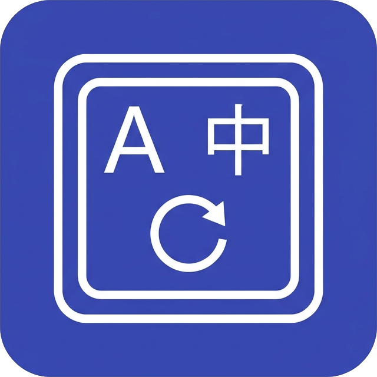
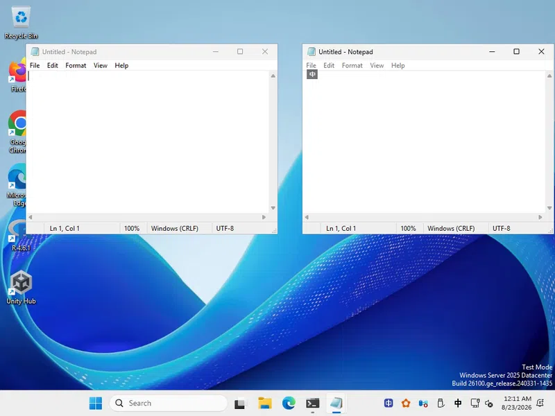
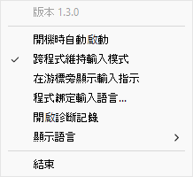
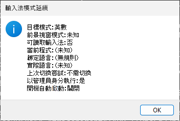
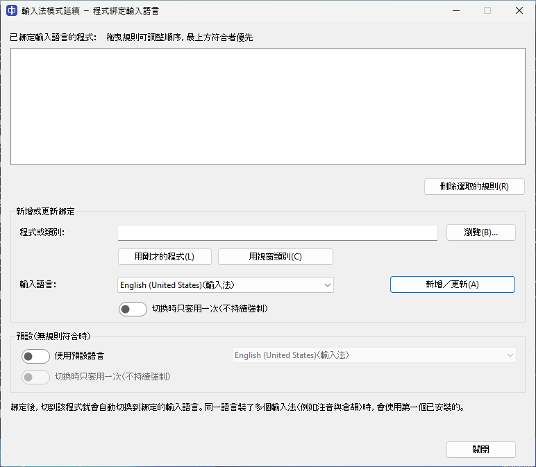
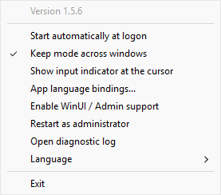
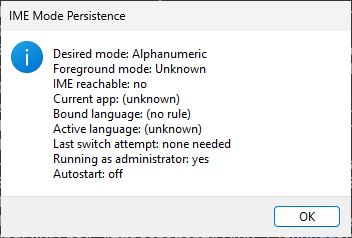
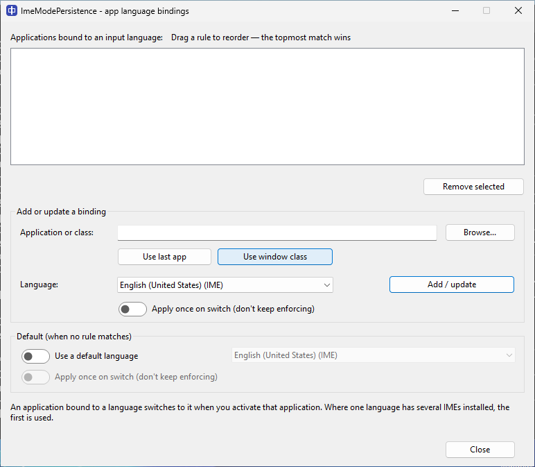

<h1>
  &nbsp;輸入法工具箱 <sub>IME Mode Persistence</sub>
</h1>

**跨視窗維持中/英，並為程式綁定輸入語言**

[](https://apps.microsoft.com/detail/9P05QQZ2P5XC)

[](https://github.com/mangokingTW/ImeModePersistence/actions/workflows/windows-build.yml)
[](https://github.com/mangokingTW/ImeModePersistence/actions/workflows/codeql.yml)
[](https://scorecard.dev/viewer/?uri=github.com/mangokingTW/ImeModePersistence)
[](https://www.bestpractices.dev/projects/14007)
[](https://github.com/mangokingTW/ImeModePersistence/releases/latest)
[](https://github.com/mangokingTW/ImeModePersistence/releases)
[](LICENSE)

**繁體中文** · [English](#english)

Windows 小工具，控制輸入法在程式之間的行為：切換視窗時延續你最後選擇的**輸入模式**（中文／英數），並可把指定程式**綁定到固定的輸入語言** —— 連讀不到執行檔的程式也行，例如有防作弊的全螢幕遊戲。

操作教學在 **[Wiki](https://github.com/mangokingTW/ImeModePersistence/wiki)**，設計取捨與被否決的做法在 **[docs/design.md](docs/design.md)**。與同類工具的比較見 **[Wiki 的同類工具頁](https://github.com/mangokingTW/ImeModePersistence/wiki/Similar-tools)**。

## 這是什麼

在 A 視窗用中文輸入 → 切到 B 視窗，中文模式被還原。你在 B 按 Shift 改成英數 → 切到 C 視窗，還原的是英數。全域目標跟著你最近一次的手動切換走，可以在托盤選單關閉。

已在實機上與**微軟注音**確認可用，支援**游標輸入指示器**（在文字游標旁動態顯示 `中` / `A` 狀態徽章）。



## 為什麼會需要它

Windows 把輸入法狀態綁在**每個執行緒**上。切到另一個視窗時，中／英轉換模式會回到該輸入法的預設值 —— 對中文鍵盤來說就是**中文**。所以你剛按 Shift 切成英數，換個視窗又打出中文。

「設定 → 時間與語言 → 輸入 → 進階鍵盤設定」裡的**「允許我為每個應用程式視窗使用不同的輸入法」解決不了這件事**。那個設定管的是「哪一個輸入法在作用」，不管「該輸入法處於中文還是英數」—— 關掉它之後，切換視窗照樣切回中文。

**沒有任何 Windows 設定能處理轉換模式** —— 這是這個工具的**第一個**目的：讓你選的中／英模式跟著你走。

**第二個**目的是把特定程式固定在某個輸入語言，包含連設定都碰不到的那類：**使用 raw input 的全螢幕遊戲**直接讀取鍵盤裝置，完全不參與輸入法的狀態管理，只能從外部處理。[Helldivers 2](https://github.com/mangokingTW/ImeModePersistence/wiki/Helldivers-2) 就是這種。

## 安裝

**最簡單：從 [Microsoft Store](https://apps.microsoft.com/detail/9P05QQZ2P5XC) 安裝**（自動更新）。或到 [Releases](https://github.com/mangokingTW/ImeModePersistence/releases) 下載：

| 檔案 | 說明 |
|---|---|
| `...-setup.exe` | **推薦**：標準安裝檔（安裝時可選擇為目前使用者或全機安裝） |
| `...-x64.zip` | 免安裝，解壓即用 |

> **防毒軟體可能刪除安裝檔。** 未簽章的安裝檔常被啟發式誤判 —— 遇到時改用免安裝的 zip，功能完全相同。

### 套件管理器

| 工具 | 指令 |
|---|---|
| **Scoop** | `scoop bucket add mango https://github.com/mangokingTW/scoop-bucket`<br>`scoop install mango/ImeModePersistence` |
| **winget** | `winget install mangokingTW.ImeModePersistence` |
| **Chocolatey** | `choco install imemodepersistence` |

> Scoop 已可用。winget 與 Chocolatey 的套件正在各自社群審核中，通過後即可安裝。

安裝時有兩個勾選項。「開機時自動啟動」：**兩個版本都是以一般權限**在登入時啟動（寫 HKCU 登錄項目，不建立提權排程工作）。要控制**提權的程式（多數反作弊遊戲）**時，用托盤選單的**以管理員身分重新啟動**當場提權（每次開機後、開玩前按一次，過一次 UAC）。「綁定 Helldivers 2 為英文輸入」：預設不勾，勾了會在第一次啟動時自動加上 `class:stingray_window` → 英文的規則（若你已有自己的規則就不覆蓋，日後刪掉也不會復活）。

**進階：讓 admin 版開機就以提權啟動。** 這是刻意不內建的——登入時靜默提權啟動正是防毒行為偵測會標記的持續化（persistence）模式，所以 app 內建的開機啟動一律未提權。若你確定要，可自行用工作排程器建立。以**系統管理員**開啟命令提示字元，執行（路徑換成你的實際安裝位置）：

```
schtasks /Create /TN "ImeModePersistence-Elevated" /TR "\"C:\Program Files\ImeModePersistence\ImeModePersistence.exe\"" /SC ONLOGON /RL HIGHEST /F
```

`/RL HIGHEST` 讓它登入時以最高權限啟動且**不跳 UAC**。建立後，請到托盤選單把 app 內建的**開機時自動啟動**關掉，否則未提權的 HKCU Run 登錄項目會在登入時再開一個未提權實例。要移除這個排程：`schtasks /Delete /TN "ImeModePersistence-Elevated" /F`。

**更新**：執行新版安裝檔，會就地升級並自動關閉重啟執行中的副本；也會清掉舊版可能留下的提權排程工作。**卸除**：設定 → 應用程式。安裝目錄與登錄項目都會清掉。

## 使用

常駐在通知區域。右鍵選單：**跨程式維持輸入模式**（可關閉）、**開機時自動啟動**、**程式綁定輸入語言…**、**啟用現代視窗 (WinUI) 支援…**（未提權時可選，用 Sidecar Helper 服務）、**以管理員身分重新啟動**（未提權時才出現）、**結束**。

<p align="center"></p>

**把滑鼠停在圖示上**會顯示當前程式、綁定語言、實際語言與上次切換結果 —— 停留不會改變前景視窗，點下去會。左鍵雙擊顯示完整狀態。每個登入工作階段只有一份執行中。

<p align="center"></p>

切換沒有如預期作用時，右鍵選單的**開啟診斷記錄**會叫出 `%LocalAppData%\ImeModePersistence\log.txt`，裡面記錄每次上下文切換、規則比對結果、以及切換用了哪個機制與是否成功。回報問題時附上它。

### 程式綁定輸入語言

把程式綁定到一個輸入語言，例如終端機綁英文、Word 綁中文。

<p align="center"></p>

- **瀏覽** 選執行檔 → 規則是那個**完整路徑**，同名的兩個執行檔可以分開設定
- 只填**檔名**（`notepad.exe`）→ 不管裝在哪都套用
- **用視窗類別** 填 `class:類別名` → 有防作弊的遊戲讀不到路徑（連管理員也讀不到），視窗類別是唯一不碰該程式就能識別它的方式
- **用剛才的程式** 自動填入你開這個視窗之前用的程式

清單可**拖拉排序，第一個符合的規則優先**（預設依精確度：完整路徑 → 檔名 → 視窗類別 → 萬用字元）。每條規則可設**只套用一次**（切到時設一次、之後不強制，不勾則持續維持）；都不符合時可啟用一條**預設語言**（預設關閉）。綁定的是**語言**，同一語言裝多個輸入法（注音與倉頡都是 zh-TW）時用第一個已安裝的。

**已確認可用於有防作弊的全螢幕遊戲** —— Helldivers 2 用 `class:stingray_window` 即可，詳見 [Wiki](https://github.com/mangokingTW/ImeModePersistence/wiki/Helldivers-2)。

### 游標輸入指示器

托盤選單的**在游標旁顯示輸入指示**可開啟一個小徽章，貼在文字游標旁，顯示目前**會打出什麼**：`中`／`日`／`한`(該語言的輸入模式)、`Ａ`(輸入法切到英數)、或 `EN` 等語言代碼。**預設關閉**，設定會記住。

它會避開自己的視窗、跟著游標走。在**瀏覽器網址列**這類程式,因為 Chromium 對外回報的游標位置不可靠,徽章改顯示在該行**上方**、不遮住文字。

## 現代 TSF/WinUI 程式支援

**新版記事本等封裝/WinUI 程式**的輸入欄位在焦點子視窗、受 Windows UIPI 機制保護：

- **Sidecar Helper 支援（推薦）**：在托盤選單點擊「**啟用現代視窗 (WinUI) 支援…**」（通過一次 UAC 啟動背景輔助服務），即可由 Helper 跨越 UIPI 保護維持輸入模式。**Microsoft Store 商店版與一般桌面版皆支援此功能**！
- **桌面版亦可直接提權**：點選托盤選單「以系統管理員身分重新啟動」。
- **未啟用時**：傳統程式與 Chromium（Chrome、Discord）正常運作；新版記事本等受 UIPI 保護的現代視窗則不維持。

## 限制

- 寫入是 best-effort 並讀回驗證。IME 仍在啟動中時可能丟棄變更，重試四次後就接受目標視窗的狀態
- 讀取或修改**提權程式**的視窗需要同等權限，所以控制有防作弊的遊戲必須提權執行（或使用 Sidecar Helper）
- 介面依 Windows 顯示語言選擇：英文、繁體中文、簡體中文、日文、韓文（後三者為機器翻譯）；安裝程式仍是英文
- 深色模式：程式綁定對話框整個套用；狀態／錯誤這類暫時性小框維持淺底、僅標題列變暗（與 Windows 系統對話框一致）
- 不注入、不掛勾、不模擬按鍵。切換是向視窗投遞 Windows 標準的「切換輸入語言」通知（視窗可自行忽略），行不通再請 TSF 以公開 API 切換；仍無效就放手，愈輸愈少問

## 開發

```powershell
cmake -S . -B build -A x64 && cmake --build build --config Release
ctest --test-dir build -C Release --output-on-failure
iscc /DAppVersion=0.0.0 installer\ImeModePersistence.iss
iscc /DAppVersion=0.0.0 /DUserInstall installer\ImeModePersistence.iss
```

安裝檔需要 [Inno Setup](https://jrsoftware.org/isinfo.php) 6.3+，圖示重新產生需要 [ImageMagick](https://imagemagick.org) 7（`./tools/make_icon.sh`）。

`CMakeLists.txt` 的 `project(... VERSION ...)` 是版本的唯一來源，會寫進 `VERSIONINFO`。發版時把它 bump 到新版、推一個相符的 `vMAJOR.MINOR.PATCH` tag（CI 只擋版號倒退，平常的 PR 不必 bump）。測試版推 `vMAJOR.MINOR.PATCH-beta.N`（或 `-rc.N`）—— 會發成 GitHub pre-release、不會變成 Latest；`scoop install mango/ImeModePersistence-beta` 可追測試版。

## 授權

[MIT](LICENSE)

## Roadmap

- [x] TSF 感知的轉換模式配接、還原後重試與驗證、區分使用者操作與系統事件
- [x] 微軟注音實機驗證
- [x] 開機自動啟動、設定介面、Windows CI、安裝檔與發佈流程
- [x] 程式綁定輸入語言，含視窗類別與萬用字元（glob）綁定
- [x] 游標輸入指示器（游標旁的語言／模式徽章，預設關閉）
- [x] Sidecar Helper 架構（支援 Store 版與一般權限下維持 WinUI/TSF 視窗）
- [ ] 同語言多輸入法的細分（注音 vs 倉頡）

---

# English

Windows utility that controls how input methods behave across programs: it carries the **input mode you last chose** (native or alphanumeric) to the next window, and can **bind a program to a fixed input language** — including programs whose executable cannot be read, such as anti-cheat protected fullscreen games.

Step-by-step guides are in the **[wiki](https://github.com/mangokingTW/ImeModePersistence/wiki/Home-English)**; design trade-offs and rejected approaches in **[docs/design.md](docs/design.md)**. How it compares to similar tools is on the **[wiki](https://github.com/mangokingTW/ImeModePersistence/wiki/Similar-tools-English)**.

## What it does

Type Chinese in window A → switch to B, Chinese is restored. Press Shift in B to go alphanumeric → switch to C, alphanumeric is restored. The global target follows your most recent deliberate change, and can be turned off from the tray menu.

Confirmed working with **Microsoft Bopomofo** on real hardware, with optional **Caret Input Indicator** (dynamic `中` / `A` status badge next to your text cursor).


## Why you would want it

Windows keeps IME state **per thread**. Move to another window and the conversion mode reverts to the IME's default — for a Chinese keyboard, that means **Chinese**. So you press Shift for alphanumeric, switch window, and you are typing Chinese again.

**Settings → Time & language → Typing → Advanced keyboard settings → _Let me use a different input method for each app window_ does not fix this.** That setting governs *which* input method is active, not whether that method is in native or alphanumeric mode — turn it off and switching windows still reverts to Chinese.

**No Windows setting covers the conversion mode.** That is this utility's **first** purpose: carrying the native/alphanumeric mode you chose to the next window.

Its **second** purpose is pinning a specific program to an input language, including the kind no setting can reach: a **fullscreen game reading raw input** takes the keyboard directly and does not participate in IME state management at all, so it can only be handled from outside. [Helldivers 2](https://github.com/mangokingTW/ImeModePersistence/wiki/Helldivers-2-English) is one.

## Install

**Easiest: get it from the [Microsoft Store](https://apps.microsoft.com/detail/9P05QQZ2P5XC)** (auto-updates). Or from [Releases](https://github.com/mangokingTW/ImeModePersistence/releases):

| File | What it is |
|---|---|
| `...-setup.exe` | **Recommended**: standard installer (supports per-user or all-users installation) |
| `...-x64.zip` | Portable; unzip and run |

> **Antivirus may delete the installer.** Unsigned installers are frequently caught by heuristics — use the portable archive, which is functionally identical.

### Package managers

| Tool | Command |
|---|---|
| **Scoop** | `scoop bucket add mango https://github.com/mangokingTW/scoop-bucket`<br>`scoop install mango/ImeModePersistence` |
| **winget** | `winget install mangokingTW.ImeModePersistence` |
| **Chocolatey** | `choco install imemodepersistence` |

> Scoop is available now. The winget and Chocolatey packages are pending community moderation and will install once approved.

Setup has two options. *Start automatically at logon*: **both variants start unelevated** at logon (an HKCU registry entry; no elevated scheduled task). To control an **elevated program (most anti-cheat games)**, use **Restart as administrator** in the tray menu to elevate on the spot — once per session, before playing, accepting one UAC prompt. *Bind Helldivers 2 to English input* (off by default): on first run it adds a `class:stingray_window` → English rule for you — it never overwrites a rule you already have, and does not come back if you later remove it.

**Advanced: start the admin variant elevated at logon.** This is deliberately not built in — a silent elevated launch at logon is the persistence pattern antivirus behaviour detection flags, so the app's own autostart is always unelevated. If you're sure you want it, set it up yourself with Task Scheduler. From an **administrator** command prompt, run (replace the path with your actual install location):

```
schtasks /Create /TN "ImeModePersistence-Elevated" /TR "\"C:\Program Files\ImeModePersistence\ImeModePersistence.exe\"" /SC ONLOGON /RL HIGHEST /F
```

`/RL HIGHEST` starts it with highest privileges at logon with **no UAC prompt**. After creating it, turn **off** the app's own *Start automatically at logon* in the tray menu, or the unelevated HKCU Run entry will launch a second, unelevated copy at logon. To remove the task: `schtasks /Delete /TN "ImeModePersistence-Elevated" /F`.

**Updating**: run the newer installer; it upgrades in place, closing and restarting a running copy, and removes any elevated scheduled task an older version left behind. **Uninstalling**: Settings → Apps. The install directory and registry entries all go.

## Using it

It lives in the notification area. Right-click for **Keep mode across windows** (which can be turned off), **Start automatically at logon**, **App language bindings...**, **Enable WinUI/Admin support...** (shown when unelevated; uses a Sidecar Helper service), **Restart as administrator** (shown only when not elevated) and **Exit**.

<p align="center"></p>

**Hover** the icon to see the current program, its bound language, the language actually in use, and whether the last switch worked — hovering does not change the foreground window, clicking does. Double-click for full status. One instance runs per logon session.

<p align="center"></p>

When a switch does not do what you expect, **Open diagnostic log** in the tray menu opens `%LocalAppData%\ImeModePersistence\log.txt`, which records every context switch, whether a rule matched, and which mechanism was used with its outcome. Attach it when reporting a problem.

### App language bindings

Bind a program to an input language — a terminal to English, Word to Chinese.

<p align="center"></p>

- **Browse** for an executable → the rule is that **full path**, so two executables sharing a name can be configured separately
- A bare **file name** (`notepad.exe`) → applies wherever the program is installed
- **Use window class** → `class:<name>`, the only way to identify an anti-cheat protected game, whose path cannot be read even by an administrator
- **Use last app** → fills in the program you were in before opening the dialog

**Drag** bindings to reorder them; the **first that matches wins** (by default they are ordered by specificity: full path, file name, window class, then wildcards). A binding can **apply once** — set on the switch, then left alone rather than held — and an opt-in **default** (off by default) supplies a language when none match. A binding pins a **language**; where one language has several IMEs installed (Bopomofo and Cangjie are both zh-TW) the first is used.

**Confirmed working for anti-cheat protected fullscreen games** — Helldivers 2 needs `class:stingray_window`; see the [wiki](https://github.com/mangokingTW/ImeModePersistence/wiki/Helldivers-2-English).

### Caret input indicator

**Show input indicator at the cursor** in the tray menu turns on a small badge beside the text caret showing what you will actually type: `中` / `あ` / `한` (that language's native mode), `Ａ` (the IME switched to alphanumeric), or a language code such as `EN`. **Off by default**; the choice is remembered.

It stays out of its own windows and follows the caret. In fields where the reported caret position is unreliable — a browser address bar, because of a Chromium limitation — the badge is drawn above the line instead, so it does not cover the text.

## Modern TSF/WinUI app support

**Modern TSF/WinUI apps (the packaged Windows 11 Notepad and similar)** have their edit fields in focused child windows protected by Windows UIPI:

- **Sidecar Helper support (Recommended)**: Click **"Enable WinUI/Admin support..."** in the tray menu (accepting one UAC prompt to start an elevated helper service). The helper bridges UIPI barriers to hold the input mode seamlessly. **Supported in both the Microsoft Store and desktop builds!**
- **Desktop build direct elevation**: Or click "Restart as administrator".
- **When disabled**: Classic and Chromium apps (Chrome, Discord) still work normally; UIPI-protected modern windows do not persist.

## Limitations

- Writes are best-effort and verified by reading back. An IME still activating can discard one; after four attempts the utility accepts whatever the target settled on
- Reading or changing the windows of an **elevated** program requires equal privileges, so controlling an anti-cheat protected game means running elevated (or using Sidecar Helper)
- The interface follows Windows' display language — English, Traditional Chinese, Simplified Chinese, Japanese or Korean (the last three machine-translated); the installer is English only
- Dark mode themes the App-language-bindings dialog fully; the transient status and error boxes keep a light body with a dark title bar, as Windows' own system dialogs do
- Nothing is injected, hooked or synthesised. Switching posts the window Windows' standard input-language-change notification (which it is free to ignore), then falls back to TSF's public API; where neither takes, the utility backs off, asking less the more it loses

## Development

```powershell
cmake -S . -B build -A x64 && cmake --build build --config Release
ctest --test-dir build -C Release --output-on-failure
iscc /DAppVersion=0.0.0 installer\ImeModePersistence.iss
iscc /DAppVersion=0.0.0 /DUserInstall installer\ImeModePersistence.iss
```

The installers need [Inno Setup](https://jrsoftware.org/isinfo.php) 6.3 or newer; regenerating the icon needs [ImageMagick](https://imagemagick.org) 7 (`./tools/make_icon.sh`).

`project(... VERSION ...)` in `CMakeLists.txt` is the single source of truth, stamped into `VERSIONINFO`. Bump it when releasing and push a matching `vMAJOR.MINOR.PATCH` tag (CI only rejects a version that moves backward; ordinary PRs need no bump). For a test build push `vMAJOR.MINOR.PATCH-beta.N` (or `-rc.N`): it publishes as a GitHub pre-release, never becomes "Latest", and `scoop install mango/ImeModePersistence-beta` tracks it. The full release, packaging, and Microsoft Store publishing flow is documented in **[docs/PACKAGING.md](docs/PACKAGING.md)**.

## License

[MIT](LICENSE)
